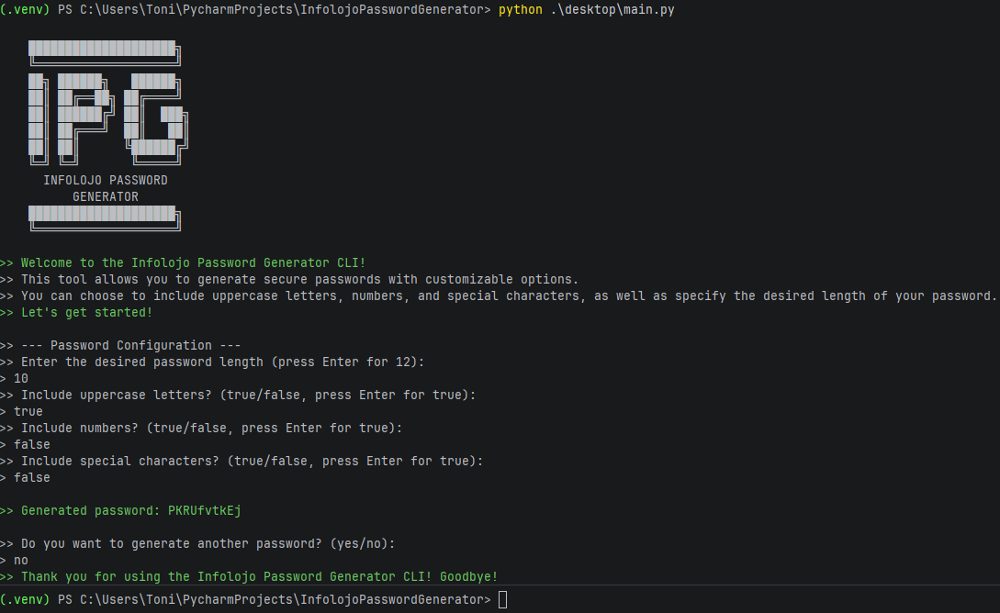
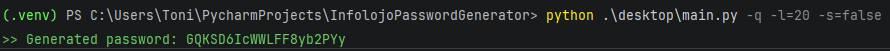
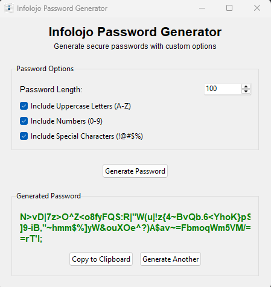

# Infolojo Password Generator

A secure and flexible password generator tool that allows you to create strong passwords with customizable options.

## Overview

This project provides three ways to generate passwords:

- **CLI Mode**: Interactive terminal interface that prompts you for each password option
- **Quick Mode**: Fast password generation with command-line arguments or default settings
- **GUI Mode**: Desktop graphical interface powered by Tkinter

## Features

- Customizable password length (default: 12 characters, range: 4-64)
- Toggle uppercase letters inclusion
- Toggle numbers/digits inclusion
- Toggle special characters inclusion
- Input validation with sensible defaults
- Professional terminal UI with colored output
- Desktop GUI with copy-to-clipboard functionality

## Installation

```bash
# Clone the repository
git clone <repository-url>
cd InfolojoPasswordGenerator/desktop
```

#### Cli Mode Examples


### CLI Mode (Interactive)

Run without arguments to enter interactive mode:

```bash
python main.py
```

The tool will prompt you for:
1. Password length (default: 12)
2. Include uppercase letters (default: true)
3. Include numbers (default: true)
4. Include special characters (default: true)

Press **Enter** to accept any default value. After generating a password, you can choose to generate another one.

### Quick Mode (Command-Line)

Run with the `-q` flag for quick password generation:

```bash
python main.py -q
```

This generates a password with default settings (12 characters, uppercase, numbers, special characters).

#### Quick Mode Options

| Flag | Description | Example |
|------|-------------|---------|
| `-l=<number>` | Set password length | `-l=16` |
| `-u=<true/false>` | Include uppercase | `-u=true` |
| `-n=<true/false>` | Include numbers | `-n=true` |
| `-s=<true/false>` | Include special chars | `-s=true` |

#### Quick Mode Examples

```bash
# Default quick password (12 chars, all options enabled)
python main.py -q

# 16 character password
python main.py -q -l=16

# 20 chars, uppercase only, no numbers, with special chars
python main.py -q -l=20 -u=true -n=false -s=true
```



### GUI Mode (Desktop)

Run with the `-gui` flag to launch the graphical interface:

```bash
python main.py -gui
```

The GUI provides:
- Password length slider (4-64 characters)
- Checkboxes for uppercase, numbers, and special characters
- Generate Password button
- Display area for generated password
- Copy to Clipboard button
- Generate Another button

#### GUI Mode Examples



### Running Directly

You can also run each module directly:

```bash
# CLI mode
python cli_launch.py

# Quick mode
python quick_launch.py

# GUI mode
python app.py
```

## Project Structure

```
InfolojoPasswordGenerator/
├── desktop/
│   ├── main.py              # Application entry point
│   ├── core/                # Core package
│   │   ├── __init__.py      # Package exports
│   │   ├── constants.py     # Configuration constants
│   │   ├── utils.py         # Utility functions
│   │   ├── logger.py        # Terminal output formatting
│   │   └── password_generator.py  # Password generation logic
│   ├── cli/                 # CLI mode package
│   │   ├── __init__.py
│   │   └── cli_launch.py    # CLI interactive mode
│   ├── quick/               # Quick mode package
│   │   ├── __init__.py
│   │   └── quick_launch.py  # Quick mode
│   └── desktop_ui/          # GUI mode package
│       ├── __init__.py
│       └── app.py           # Tkinter GUI application
└── README.md                # This file
```

## Requirements

- Python 3.x

## Next Versions

Stay tuned for upcoming releases that will expand the Infolojo Password Generator to new platforms:

### 📱 Android App (Kotlin) - Coming Soon

A native Android application built with Kotlin, bringing the power of secure password generation to your mobile devices. Features include:

- Intuitive mobile-friendly interface
- Password history and management
- Biometric authentication support
- Quick copy to clipboard functionality

The Android app will share the same core password generation logic, ensuring consistent security across all platforms.

---

## License

MIT License

Copyright (c) 2026 Infolojo

Permission is hereby granted, free of charge, to any person obtaining a copy
of this software and associated documentation files (the "Software"), to deal
in the Software without restriction, including without limitation the rights
to use, copy, modify, merge, publish, distribute, sublicense, and/or sell
copies of the Software, and to permit persons to whom the Software is
furnished to do so, subject to the following conditions:

The above copyright notice and this permission notice shall be included in all
copies or substantial portions of the Software.

THE SOFTWARE IS PROVIDED "AS IS", WITHOUT WARRANTY OF ANY KIND, EXPRESS OR
IMPLIED, INCLUDING BUT NOT LIMITED TO THE WARRANTIES OF MERCHANTABILITY,
FITNESS FOR A PARTICULAR PURPOSE AND NONINFRINGEMENT. IN NO EVENT SHALL THE
AUTHORS OR COPYRIGHT HOLDERS BE LIABLE FOR ANY CLAIM, DAMAGES OR OTHER
LIABILITY, WHETHER IN AN ACTION OF CONTRACT, TORT OR OTHERWISE, ARISING FROM,
OUT OF OR IN CONNECTION WITH THE SOFTWARE OR THE USE OR OTHER DEALINGS IN THE
SOFTWARE.

---
see more in https://www.infolojo.es